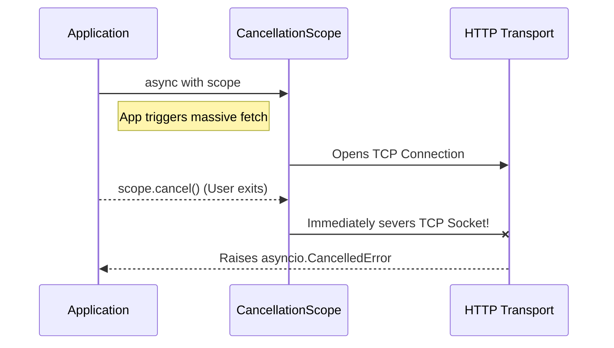

# Advanced Usage

The Python client includes a suite of advanced features designed to maximize network throughput and handle extremely massive datasets safely. 

## High-Concurrency Pagination (`collect_all`)

The `collect_all()` engine is the most powerful feature of the wrapper. Unlike traditional pagination (where a client waits for page 1 to load before requesting page 2), `collect_all()` uses synthetic time-sliced cursors to split a timeline into chunks and requests them all concurrently.

```python
# Fetches thousands of transaction logs simultaneously.
# The `time_slice_days` parameter breaks the timeline into 0.2-day chunks (approx 5 hours).
# The `concurrency` parameter dictates how many HTTP chunks to fire at once.
logs = await warera.transaction.collect_all(
    oldest_date="2026-01-01T00:00:00Z",
    time_slice_days=0.2, 
    concurrency=500
)
```

> [!WARNING]
> **Rate Limit Note**: A `concurrency=500` will instantly saturate the API's global rate limit of 500 requests per minute. The library implements transparent 429 backoff protection via jitter, but hitting the API this hard may cause `502 Bad Gateway` errors from upstream load balancers if you are querying highly demanding databases. Dial down `concurrency` to 100 if you experience random disconnects.


## Cancellation Scopes

If you trigger a massive `collect_all()` task but the user closes their browser or navigates away, you don't want the SDK to keep burning API rate limits on background requests. You can gracefully abort operations using a `CancellationScope`.



```python
from warera import CancellationScope
import asyncio

async def fetch_data(scope: CancellationScope):
    async with scope:
        # If scope.cancel() is called elsewhere, this task immediately aborts.
        # It will also seamlessly prevent any pending requests from leaving the queue.
        return await warera.transaction.collect_all(oldest_date="2026-01-01")

async def main():
    scope = CancellationScope()
    task = asyncio.create_task(fetch_data(scope))
    
    await asyncio.sleep(2)
    scope.cancel() # Aborts the massive fetch operation early!
```

## Persistent SWR Caching

When fetching heavily hit static resources (like `game_config` or `country_list`), the SDK automatically uses a Stale-While-Revalidate pattern to return local memory instantly while firing a silent refresh task.

To persist this data across bot restarts or server crashes, you can configure the client to use the `SQLiteCacheBackend`.

```python
from warera import WareraClient
from warera.cache_backends import SQLiteCacheBackend

# All SWR-cached requests will now survive process restarts!
client = WareraClient(cache_backend=SQLiteCacheBackend("warera_cache.sqlite"))
```

## Request Priorities

In complex applications, you may have background workers fetching millions of records while a user clicks a button that needs an instant response. To prevent the user's request from getting stuck behind 10,000 background jobs in the auto-batching queue, use `RequestPriority.HIGH`.

```python
from warera import RequestPriority

# Normal Priority (Gets batched implicitly)
users = await client.user.get_many(["1", "2", "3"]) 

# HIGH Priority (Instantly flushes its batch to the network)
critical_user = await client.user.get_by_id("123", priority=RequestPriority.HIGH)
```

## Telemetry Observability

You can track internal SDK metrics (like rate limit sleeps, chunk efficiencies, and cache hit rates) by injecting a `TelemetryHooks` protocol implementation.

```python
from warera import TelemetryHooks

class MyDatadogHooks(TelemetryHooks):
    def on_cache_hit(self, procedure: str):
        print(f"[CACHE HIT] {procedure}")
        
    def on_rate_limit_sleep(self, duration: float):
        print(f"[RATE LIMIT] Slept for {duration} seconds!")

client = WareraClient(telemetry_hooks=MyDatadogHooks())
```

