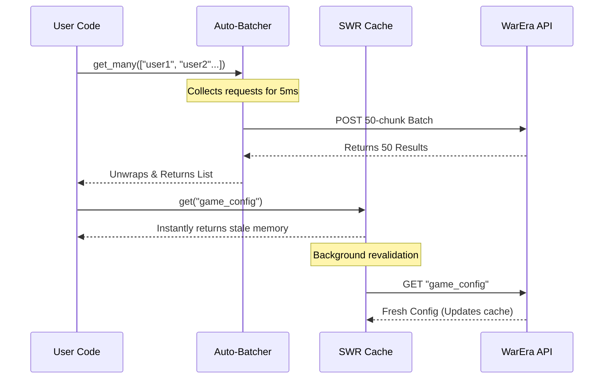

# Welcome to the WarEra API Client

The `warera-client` is a robust, type-safe Python SDK for the WarEra Game API. It features extreme throughput optimizations, smart caching, and native Pydantic integrations to make building bots and analytical tools a breeze.

## Installation

```bash
pip install warera-client
```

## Quick Start

You don't need to manually instantiate a client class for basic usage. The library exposes a global API that handles connection pooling under the hood.

```python
import asyncio
import warera

async def main():
    # Fetch a single user by ID
    user = await warera.user.get_by_id("123")
    print(f"User Name: {user.name}")

    # Fetch multiple users in an automated batch request
    users = await warera.user.get_many(["1", "2", "3"])
    print(f"Loaded {len(users)} users efficiently.")

if __name__ == "__main__":
    asyncio.run(main())
```

## Configuration

If you need to configure the underlying HTTP session, retry logic, or concurrency limits, you can construct a custom `WareraClient` and use it as a context manager:

```python
import asyncio
from warera import WareraClient

async def main():
    # Pass custom configuration here
    async with WareraClient(max_retries=3) as client:
        company = await client.company.get("100")
```

## Features at a Glance

1. **Auto-Batching**: Any `.get_many()` call is automatically chunked into optimized batch requests of 50 procedures each, drastically reducing round-trip latency.
2. **SWR Disk Caching**: Heavy endpoints like `game_config` are cached to disk and served instantly using a Stale-While-Revalidate pattern.
3. **Time-Slice Pagination**: Grab thousands of records instantly using the `collect_all()` engine.



To learn more about these powerful features, visit the [Advanced Usage](Advanced-Usage) page!

## API Reference

Check out the [API Reference](API-Reference) to explore all 32 available resource namespaces and their perfectly typed models.
